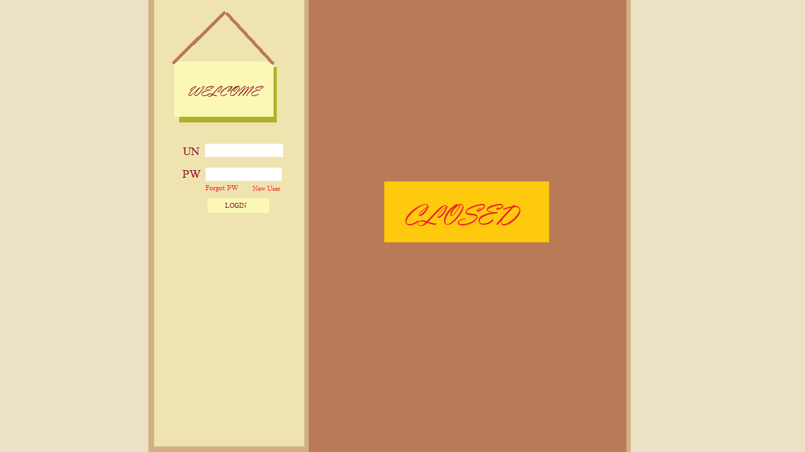

# BookKeeper

## Overview
Bookkeeper is a web application developed using ASP.NET, React, and T-SQL. The purpose of the application is to create a social network where readers can interact with each other. Users can keep track of books they have read and give their opinions on it.

## Usage
New users will be welcomed with a screen showing off a closed bookshelf and a login menu on the left. As the user has no account yet, they must register and login in order for the bookshelf to open.  

New User Front Page Example  

After the user has logged in the bookshelf case on the right will open to reveal books that the user has read. The left panel will also transform to show off the user's profile such as the books they have read and their description.

Logged in User Front Page Example

### Bookshelf
The bookshelf section will be composed of books that the users have read. If the amount of books the user has read exceeds the screen space, the user will be able to drag the shelf up and down.

Mousing over each book, the user can open up a menu that gives a deeper description regarding the book. Not only that but they can also add their review and see other user reviews as well.

When adding a new book, the user can click on an empty book space or right-click onto the shelf and add it. The user will be asked to submit a picture for the cover and other descriptions regarding the book.

Future plans include fetching books using a third party API.

### Socialization
Readers can also choose to look at other bookshelfs for other users! To do this, they would simply search for the user's name and find it that way.

## Current Plans
The following are the current plans to add into the web application.
- bookshelf
- books with information
  - reviews
  - authors
  - readers
  - genres
- user stats page
- user account storage
- adding books the user has read
- searching up other users

## Future Plans
Future plans are what will be added after the current plans are finished and stable.
- connection to 3rd party API
- a random book recommendation system
- customization of bookshelf screen